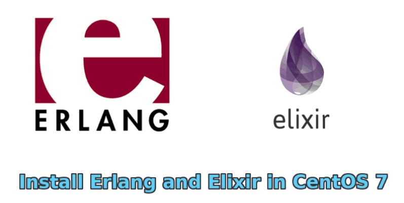

# Install Erlang and Elixir in CentOS 7



## **Erlang 介绍**
- Erlang是一种开源编程语言，用于构建具有高可用性要求的大规模可扩展软实时系统。 它的一些用途是电信，银行，电子商务，电脑电话和即时消息。 Erlang的运行时系统内置了对并发，分布和容错的支持。 它是在爱立信计算机科学实验室设计的。

## **Elixir 介绍**
- Elixir是一款动态的功能性语言，专为构建可扩展和可维护的应用程序而设计。 Elixir利用以运行低延迟，分布式和容错系统而闻名的Erlang虚拟机，同时也成功用于Web开发和嵌入式软件领域。
- 本次我们选择在CentOS7上安装相应的环境。

## **准备工作**
- 运行如下命令：
  ``` bash
  yum update -y
  yum install epel-release -y
  yum install gcc gcc-c++ glibc-devel make ncurses-devel openssl-devel autoconf git wget wxBase.x86_64
  ```
## **安装 Erlang**
- 安装最新版的Erlang：
- Erlang官方库文件参见[Erlang repository page](https://packages.erlang-solutions.com/erlang/), 我们需要根据我们的需要下载对应的版本。
  ``` bash
  cd /opt/soft
  wget http://packages.erlang-solutions.com/erlang-solutions-1.0-1.noarch.rpm
  rpm -Uvh erlang-solutions-1.0-1.noarch.rpm
  yum makecache
  yum install erlang -y
  ```
- 到这里，Erlang基本安装完成！

## **确认Erlang的安装情况**
- 运行如下
  ``` bash
  erl   # 一般有这个命令表示安装完成
  ```
## **安装 Elixir**
- Elixir 有自己的 EPEL 源，但版本较老，所以我们需要安装较新版本的软件，在安装 Elixir 时需要确保 Erlang 已经安装完成。
- 下载软件包:
  ``` bash
  cd /usr/local
  git clone https://github.com/elixir-lang/elixir.git
  ```
- 我们的安装路径为`/usr/local/elixir`

- 开始安装
  ```bash
  cd /usr/local/elixir/
  make clean test
  ```
- 安装过程需要耐心等待。
- **注意：在安装过程中可能会报错，可能是版本的问题，我们需要更换版本再进行安装**
- 设置相关环境变量，否则不能正常使用
  ``` bash
  export PATH="$PATH:/usr/local/elixir/bin"
  ```
## **确定 Elixir 的安装结果**
-
  ``` bash
  iex  # 一般有这个命令表示安装完成
  ```
- 查看版本信息：
  ``` bash
  [root@lv-test-node elixir]# elixir --version
  Erlang/OTP 20 [erts-9.1] [source] [64-bit] [smp:1:1] [ds:1:1:10] [async-threads:10] [hipe] [kernel-poll:false]
  
  Elixir 1.6.0-dev (9941745) (compiled with OTP 20)
  ```
- 至此，在CentOS7上已经成功安装了 Erlang 和 Elixir。

