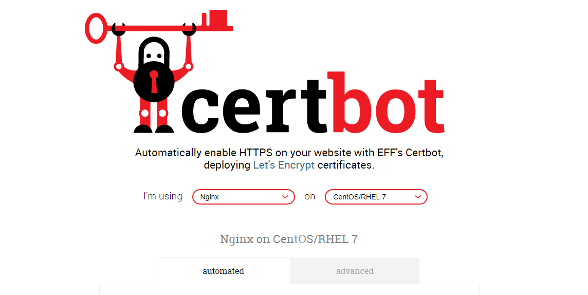

## Let's Encrypt 证书申请及配置
- Let's Encrypt 是一个免费、开放，自动化的证书颁发机构，由 ISRG（Internet Security Research Group）运作。
- ISRG 是一个关注网络安全的公益组织，其赞助商从非商业组织到财富100强公司都有，包括 Mozilla、Akamai、Cisco、Facebook，密歇根大学等等。ISRG 以消除资金，技术领域的障碍，全面推进加密连接成为互联网标配为自己的使命。
- Let's Encrypt 项目于2012年由 Mozilla 的两个员工发起，2014年11年对外宣布公开，2015年12月3日开启公测。
- Let's Encrypt 是一个于2015年三季度推出的数字证书认证机构，将通过旨在消除当前手动创建和安装证书的复杂过程的自动化流程，为安全网站提供免费的SSL/TLS证书。
- 下面我们试着申请一下Let's Encrypt证书。
- Let’s Encrypt提供的免费SSL可以说是真正意义上的免费，是由Mozilla、思科、Akamai、IdenTrust和EFF等组织发起的。目前它签发的SSL证书被Mozilla、Google、Microsoft和Apple等主流浏览器信任。Let’s Encrypt免费证书其实申请很简单，如果你有VPS的话，按照下面教程可以免费申请Let’s Encrypt SSL。

### 申请流程
- letsencrypt基于ACME协议自助颁发证书的过程由letsencrypt提供一个工具完成，工具名称现在叫做：certbot，在linux下certbot工具安装后也就是certbot命令。
- Let's Encrypt官方网站：<https://letsencrypt.org>
- certbot英文教程网站：<https://certbot.eff.org>
- 首先将你要申请Let’s Encrypt SSL的域名解析到VPS上。然后再到此页面 https://certbot.eff.org/ 根据自己系统生成安装代码。如下图，首先根据自己的建站环境，选择“Nginx或Apache”蜗牛的VPS是CentOS 7系统，和Nginx处理环境，所以选择了“Nginx”和“CentOS/RHEL 7”。
- 如下图所示：
- 
- 具体操作可以参考[官网教程](https://certbot.eff.org/#centosrhel7-nginx)

- 然后执行以下命令:
  - `yum -y install certbot`
- 安装完成后，需要进一步执行以下操作:
  - `wget https://dl.eff.org/certbot-auto`
  - `chmod +x certbot-auto`
  - `./certbot-auto certonly`
- 执行`./certbot-auto certonly`后进入了证书申请步骤，我们按要求输入相关参数即可，有可能要求输入邮箱。如果申请失败，可以重复执行`./certbot-auto certonly`申请，一般会申请成功。
- 申请成功会提示你申请证书及Key的具体路径，一般都会放在`/etc/letsencrypt/live`下以所申请域名命名的文件夹下。
- 另外需要注意的是Let’s Encrypt 免费SSL证书只有90的有效期，需要自己更新，如果以后执行自动更新也是在这里。

